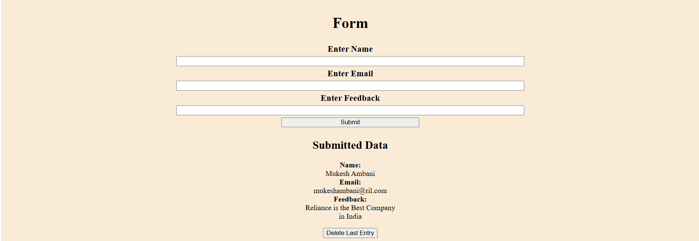

# 📌 Lists and Conditional Rendering in React

## 📚 Topics Covered
- Rendering lists with `.map()`
- Keys in React lists
- Conditional rendering techniques

---

## 📝 Project: To-Do List App

### 🎯 Objective
Learn how to dynamically render and manage a list of items with conditional rendering.

### ✅ Tasks
1. **Create a State Variable**
   - Store a list of tasks in a state variable.
   
2. **Render Task List Using `.map()`**
   - Use the `.map()` function to display tasks dynamically.

3. **Add & Remove Functionality**
   - Implement functions to add new tasks and remove existing ones.

4. **Conditional Rendering**
   - Display a message when the task list is empty.

---

# 📌 Forms and Controlled Components in React

## 📚 Topics Covered
- Handling user input in forms
- Controlled components
- Basic form validation

---

## 📝 Project: Feedback Form

### 🎯 Objective
Understand how to handle and validate user input in a React form.

### ✅ Tasks
1. **Create a Form**
   - Include input fields for `name`, `email`, and `feedback message`.

2. **Use State Variables**
   - Control form inputs using state variables.

3. **Form Validation**
   - Ensure fields are not empty before submission.

4. **Display Submitted Feedback**
   - Show the submitted feedback data below the form.

---

## 🚀 How to Run the Project

1. **Set Up React Project using Vite**
   ```bash
   npm create vite@latest my-react-app --template react
   cd my-react-app
   npm install
   npm run dev
   ```

2. **Create Components**
   - Implement the `ToDoList` and `FeedbackForm` components.

3. **Run & Test**
   - Ensure list rendering, form validation, and user interactions work as expected.

---

## 🎨 Customization
- Modify CSS styles for a better UI.
- Extend functionality, such as adding task due dates or additional validation rules.

---

## 📜 License
This project is open-source and available under the MIT License.

## 📜 Output


